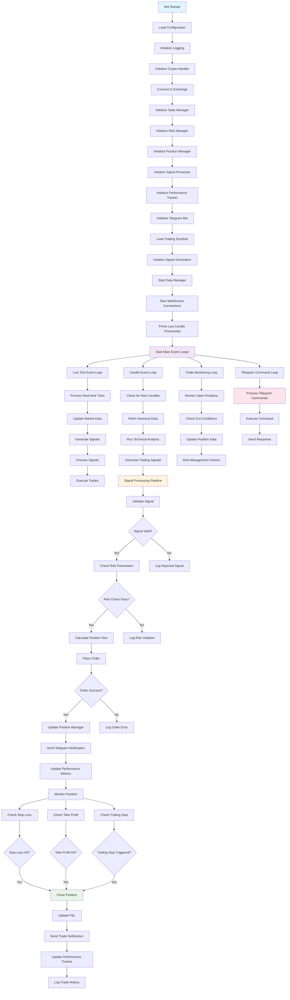
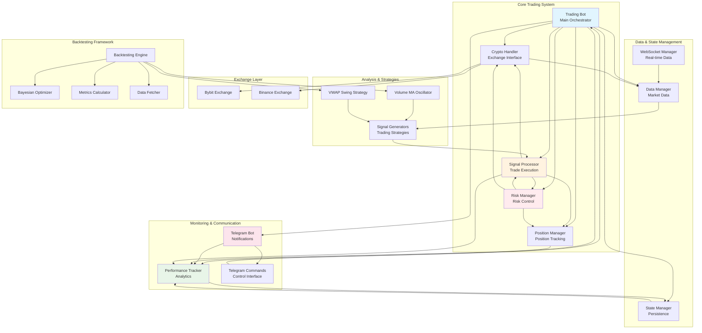

# Quant-Bot-Crypto: Advanced Algorithmic Trading System

## Overview

Quant-Bot-Crypto is a sophisticated algorithmic trading system designed for cryptocurrency markets. Built with Python and featuring advanced risk management, multiple trading strategies, real-time data processing, and comprehensive backtesting capabilities, this system provides institutional-grade trading infrastructure for crypto markets.

## 🏗️ System Architecture

The system is built with a modular, event-driven architecture that separates concerns and enables easy extension and maintenance. The core components work together to provide:

- **Real-time market data processing** via WebSocket connections
- **Advanced trading strategies** with multiple signal generators
- **Comprehensive risk management** with position sizing and stop-loss mechanisms
- **Multi-exchange support** (Bybit, Binance)
- **Telegram integration** for monitoring and control
- **Backtesting framework** with Bayesian optimization
- **Performance tracking** and analytics

## 📁 Project Structure

```
src/
├── crypto_backtesting/          # Backtesting framework
│   ├── base_strategy.py         # Abstract base strategy class
│   ├── bayesian_optimizer.py    # Bayesian parameter optimization
│   ├── data_fetcher.py          # Historical data fetching
│   ├── engine.py                # Backtesting engine
│   ├── metrics_calculator.py    # Performance metrics
│   ├── vwap_swing_strategy.py   # VWAP swing strategy
│   └── volume_ma_backtest_adapter.py  # Strategy adapter
├── exchanges/                   # Exchange implementations
│   ├── binance_exchange.py     # Binance integration
│   └── bybit_exchange.py       # Bybit integration
├── strategy/                    # Trading strategies
│   └── volume_ma_oscillator.py # Volume MA Oscillator strategy
├── telegram/                   # Telegram bot integration
│   ├── telegram_bot.py         # Main Telegram bot
│   └── crypto_telegram_command_handler.py  # Command handlers
├── utils/                      # Utility modules
│   ├── logging_setup.py        # Logging configuration
│   └── market_utils.py         # Market utilities
├── crypto_data_manager.py      # Data management
├── crypto_exchange.py          # Exchange abstraction
├── crypto_handler.py           # Unified exchange handler
├── crypto_performance_tracker.py  # Performance tracking
├── crypto_position_manager.py  # Position management
├── crypto_risk_manager.py      # Risk management
├── crypto_signal_processor.py  # Signal processing
├── crypto_state_manager.py     # State management
├── trading_bot.py              # Main trading bot
└── websocket_manager.py        # WebSocket management
```

## 🚀 Bot Operation Flow

The following flowchart demonstrates how the crypto trading bot operates from startup to execution:



## 🏛️ Component Architecture Diagram

The following diagram shows how all major components interact within the system:



## 🚀 Detailed Startup Sequence

The bot follows a specific initialization sequence to ensure all components are properly configured:

### Phase 1: Core System Initialization
1. **Configuration Loading**: Load settings from `config/config.py`
2. **Logging Setup**: Initialize structured logging with Loguru
3. **Crypto Handler**: Initialize exchange connection (Bybit/Binance)
4. **State Manager**: Load persistent state and trade history
5. **Risk Manager**: Initialize risk parameters and limits

### Phase 2: Trading Components Setup
6. **Position Manager**: Initialize position tracking system
7. **Signal Processor**: Setup signal validation and execution pipeline
8. **Performance Tracker**: Initialize analytics and reporting
9. **Data Manager**: Setup market data caching and synchronization

### Phase 3: Strategy and Analysis
10. **Signal Generators**: Initialize trading strategies (Volume MA, VWAP Swing)
11. **WebSocket Manager**: Establish real-time data connections
12. **Telegram Bot**: Initialize notification and control system

### Phase 4: Event Loop Activation
13. **Prime Timestamps**: Load last candle timestamps for each symbol/timeframe
14. **Start Event Loops**: Activate concurrent processing loops:
    - Live tick processing
    - Candle event monitoring
    - Trade management
    - Telegram command handling

## 🔧 Core Components

### 1. Trading Bot (`trading_bot.py`)
The main orchestrator that coordinates all system components:
- Manages event loops for real-time processing
- Coordinates signal generation and processing
- Handles system initialization and shutdown
- Provides Telegram command interface

### 2. Crypto Handler (`crypto_handler.py`)
Unified interface for exchange operations:
- Abstracts exchange-specific implementations
- Handles order placement and management
- Manages position tracking
- Provides market data access

### 3. Risk Manager (`crypto_risk_manager.py`)
Comprehensive risk management system:
- Position sizing calculations
- Stop-loss and take-profit management
- ATR-based risk calculations
- Daily risk limits and monitoring

### 4. Position Manager (`crypto_position_manager.py`)
Advanced position management:
- Real-time position tracking
- Trailing stop management
- Position modification capabilities
- Risk monitoring and alerts

### 5. Signal Processor (`crypto_signal_processor.py`)
Intelligent signal processing pipeline:
- Signal validation and filtering
- Market condition analysis
- Trade execution coordination
- Error handling and retry logic

### 6. Data Manager (`crypto_data_manager.py`)
Centralized data management:
- Real-time market data caching
- Historical data management
- Data synchronization across timeframes
- Database operations

### 7. State Manager (`crypto_state_manager.py`)
Persistent state management:
- Trade history tracking
- System state persistence
- Configuration management
- Recovery mechanisms

### 8. Performance Tracker (`crypto_performance_tracker.py`)
Comprehensive performance analytics:
- Real-time P&L tracking
- Trade statistics
- Performance metrics calculation
- Reporting and analysis

## 📊 Trading Strategies

### Volume MA Oscillator Strategy
Advanced oscillator-based strategy featuring:
- Volume-weighted moving averages
- Multiple filter systems (trend, volume, RSI, ADX)
- Configurable risk management
- Hybrid trend/reversion modes

### VWAP Swing Strategy
Institutional-grade swing trading strategy:
- Dynamic swing point detection
- Anchored VWAP calculations
- ADX trend filtering
- Multi-timeframe analysis

## 🔄 Backtesting Framework

Comprehensive backtesting system with:
- **Bayesian Optimization**: Automated parameter optimization using Gaussian processes
- **Enhanced Metrics**: Advanced performance metrics including Sharpe, Sortino, Calmar ratios
- **Multi-Symbol Testing**: Simultaneous optimization across multiple symbols/timeframes
- **Strategy Adapters**: Easy integration of existing strategies

## 📱 Telegram Integration

Full Telegram bot integration providing:
- Real-time trade notifications
- Performance monitoring
- Remote bot control
- Command execution
- Status reporting

## 🛡️ Risk Management Features

- **Position Sizing**: Kelly criterion and fixed percentage methods
- **Stop Loss Management**: ATR-based and percentage-based stops
- **Take Profit**: Risk-reward ratio management
- **Trailing Stops**: Dynamic stop-loss adjustment
- **Daily Limits**: Maximum daily loss and trade limits
- **Correlation Analysis**: Portfolio risk assessment

## 🔌 Exchange Support

### Bybit Integration
- Full futures trading support
- WebSocket real-time data
- Advanced order types
- Position management

### Binance Integration
- Spot and futures trading
- Comprehensive API coverage
- Real-time data streams
- Order management

## 📈 Performance Monitoring

Real-time performance tracking including:
- P&L monitoring
- Trade statistics
- Risk metrics
- Drawdown analysis
- Win/loss ratios
- Performance attribution

## 🚀 Getting Started

### Prerequisites
- Python 3.8+
- Exchange API credentials
- Telegram bot token
- Required Python packages (see requirements.txt)

### Installation
```bash
# Clone the repository
git clone <repository-url>
cd Quant-Bot-Crypto

# Install dependencies
pip install -r requirements.txt

# Configure settings
cp config/config.example.py config/config.py
# Edit config.py with your API keys and settings

# Run the bot
python main.py
```

### Configuration
Key configuration areas:
- Exchange API credentials
- Trading symbols and timeframes
- Risk management parameters
- Strategy settings
- Telegram bot configuration

## 🔧 Advanced Features

### Signal Processing Pipeline
1. **Signal Generation**: Multiple strategies generate signals
2. **Validation**: Signals are validated against market conditions
3. **Risk Assessment**: Position sizing and risk calculations
4. **Execution**: Orders are placed with proper risk management
5. **Monitoring**: Continuous position and risk monitoring

### Event-Driven Architecture
- **Live Tick Processing**: Real-time price updates
- **Candle Events**: New candle detection and analysis
- **Trade Events**: Position updates and management
- **Command Events**: Telegram command processing

### Error Handling
- Comprehensive error logging
- Automatic retry mechanisms
- Graceful degradation
- Recovery procedures

## 📊 Monitoring and Alerts

The system provides comprehensive monitoring through:
- Real-time Telegram notifications
- Performance dashboards
- Error alerts and warnings
- Trade execution confirmations
- Risk limit notifications

## 🔒 Security Features

- API key encryption
- Secure WebSocket connections
- Input validation and sanitization
- Error message sanitization
- Access control mechanisms

## 📚 Documentation

- Comprehensive code documentation
- Strategy development guides
- API reference
- Configuration examples
- Troubleshooting guides

## 🤝 Contributing

This is a professional trading system. Contributions should:
- Follow established coding standards
- Include comprehensive tests
- Maintain backward compatibility
- Include proper documentation

## ⚠️ Disclaimer

This software is for educational and research purposes. Trading cryptocurrencies involves substantial risk of loss. Past performance does not guarantee future results. Always test thoroughly in a simulated environment before live trading.

## 📄 License

[License information]

---

**Quant-Bot-Crypto** - Professional algorithmic trading for cryptocurrency markets.